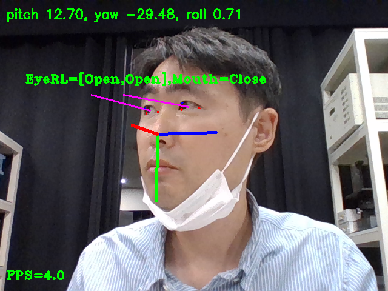
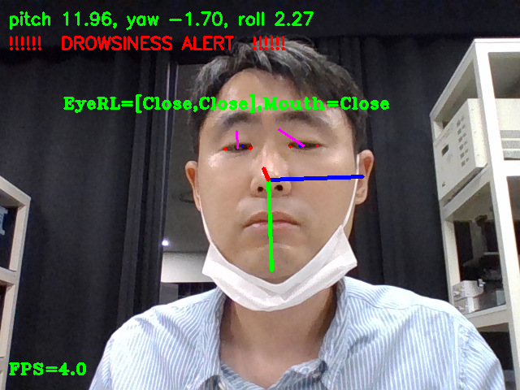

# extract head eye gaze
차량안에 실내카메라를 이용한 운전자 모니터링 프로젝트를 진행중이며, 
그안에서 stereo camera calibration을 담당하고있다.
Head Eye tracking의 경우, 외부 업체의 알고리즘을 사용하는데,
그 기술등이 은닉되어 있고, 구현 방법등이 궁금하여, 
Eye tracking을 하기위한 여러 오픈소스를 통해 구현해 보았다.
딥러닝을 통한 Head pos나 Eye gaze를 계산하는 방법들도 있지만,
카메라의 화각이나 위치에 따를 re-트레이닝이 필요할것으로 판단되어
범용적이지 못할것 같아, gaze를 계산에 의해 도출하는 방법을 개인검토 차원에서 사용해보았다. 

  

1. face를 찾기위해, dlib 사용
2. camera intrinsic calibration 진행
2. 2d face feature와 camera intrinsic param을 이용한 3d face model 좌표 추정  
3. face rotation 도출(base on euler angle)
4. 2d eye crop을 통한 pupil center 찾기
5. eye gaze base code를 통한 eye pupil에서 camera plain coord로의 gaze vector
6. eyeball center에서 eye pupil으로의 gaze vector

# description of executable file 
| FileName | Description | Remark |
| --       | --          | --     |
| ellipse_check.py|영상의 얼굴과 68가지 특징점, 이목구비구분 및 눈영역 저장| --|
| ellipse_check2.py | 눈의 동공 shape 추출 및 계산          | 동공의 형태로 방향을 판별하기위해 시도해봄     |
| video_eye_tracker_01.py      | 학습된 얼굴특징점(68,21,19,12 point)변경          | --     |
| video_eye_tracker_02.py      | face gaze, camera plain gaze, eyeball gaze      | --     |
| video_eye_tracker_03.py      | face gaze, camera plain gaze, eyeball gaze      | video bufferless     |
| video_eye_tracker_04.py      | face gaze, camera plain gaze, eyeball gaze      | view type 변경     |
| video_eye_tracker_05.py      | face gaze, camera plain gaze, eyeball gaze      | imutils video 사용     |
| PupilDetector.py       | speed up 4->12 fps          | 얼굴, 동공 찾기     |
| --     | --          | --     |
| eye_tracker_05.py      | core code          | --     |
| eye_tracker_06.py      | gaze 튜닝 및 속도 업          | --     |
| video_capture_1_in_2.py       | 2가지 영상 병합          | --     |
| video_capture_1_in_3.py       | 3가지 영상 병합          | --     |
| video_record.py       | video recoding          | --     |

# reference and code
1. https://github.com/BenjaminPoilve/Eye-Gaze-Estimator Eye gaze base code
2. https://github.com/indigopyj/Face-Yaw-Roll-Pitch-from-Pose-Estimation-using-OpenCV Head rotation
3. https://github.com/davisking/dlib-models extract face model using dlib
4. Fabian Timm and Erhardt Barth - “Accurate Eye Centre Localisation by Means of Gradients” - find pupil pos
5. https://github.com/jonnedtc/PupilDetector speed up pupilDetector
6. https://www.pyimagesearch.com/2019/12/16/training-a-custom-dlib-shape-predictor/ how to train face feature on dlib
7. https://ibug.doc.ic.ac.uk/resources/300-W/ - dlib training example
8. Li Jianfeng and Li Shigang - “Eye-Model-Based Gaze Estimation by RGB-D Camera” -  calculate vector from center of eyeball to pupil center 
9. https://learnopencv.com/face-detection-opencv-dlib-and-deep-learning-c-python/
10. https://towardsdatascience.com/cnn-based-face-detector-from-dlib-c3696195e01c
